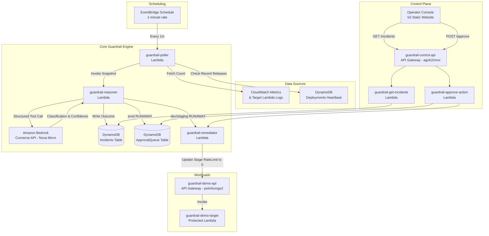

# AWS Cost Guardrail Agent ("Guardrail")

> **An autonomous, context-aware circuit breaker for serverless APIs powered by Amazon Bedrock, EventBridge, and DynamoDB.**  
> Built for the **First Commit — Bharat Builds Tour (Ship It Track)** by Pranjul Chaurasiya.

[-orange?style=for-the-badge&logo=amazonwebservices)](http://guardrail-dashboard-515903395012.s3-website.ap-south-1.amazonaws.com)

---

## 🎯 The Problem

Serverless computing scales seamlessly, but unbounded scalability creates **financial liability**. An infinite client retry loop, exponential backoff without jitter, or a recursive microservice call can generate millions of requests and thousands of dollars in surprise bills overnight.

Traditional CloudWatch static alarms (*"if requests > 100/min then alert"*) create a painful dilemma:
* **False Positives**: During a legitimate flash sale with 1,000 unique buyers, a static alarm trips and throttles paying customers.
* **Slow Remediation**: By the time an on-call engineer wakes up and inspects the logs, the damage is already done.

**AWS Cost Guardrail Agent** solves this by evaluating multi-dimensional context: **caller diversity**, **payload variance**, and **deployment heartbeats** using Amazon Bedrock to distinguish between legitimate business surges and destructive runaway loops.

---

## 🏗 System Architecture

---

## ⚡ Key Architectural Features

### 1. Isolated Control Plane
Management endpoints (`/incidents`, `/approve`) live on a dedicated REST API (`guardrail-control-api`). When `guardrail-demo-api` is throttled to 0 rps, the operator dashboard remains 100% accessible.

### 2. Single-Turn Deterministic Bedrock Contract
The Reasoner calls Amazon Bedrock's **Converse API** exactly once per cycle using `toolConfig` (`classify_anomaly`). This forces the model to respond strictly via JSON:
* `classification`: `"NORMAL"` or `"RUNAWAY"`
* `confidence`: `0.0 - 1.0`
* `explanation`: 1-2 sentence human-readable rationale.

### 3. Fail-Closed Cost Safety
If Bedrock encounters network timeouts, rate limits, or invalid model configuration, the reasoner catches the exception and safely defaults to `classification: "RUNAWAY"` (`is_fallback: true`) to ensure cost protection is never compromised.

### 4. Human-in-the-Loop Approval Gate for Production
* **Non-prod (`dev`, `staging`)**: Reasoner triggers `guardrail-remediator` immediately (`action_taken: AUTO_THROTTLED`).
* **Prod (`prod`)**: Reasoner withholds automated action, writes to `ApprovalQueue` (`status: PENDING`), and waits for an engineer to review Bedrock's rationale and click **Approve Throttle**.

### 5. Strict Idempotency
`guardrail-remediator` reads stage settings first. If `rateLimit == 0.0`, it returns `ALREADY_THROTTLED` without throwing errors or redundant AWS API calls.

---

## 📊 Live Verification & Demo Scripts

All verification scripts use real AWS APIs, real HTTP requests, and real DynamoDB records:

| Script | Purpose | Expected Outcome |
|---|---|---|
| [`scripts/simulate_naive_threshold.py`](scripts/simulate_naive_threshold.py) | Compares static threshold vs Guardrail | Demonstrates false-positive elimination |
| [`scripts/load_test_legit.py`](scripts/load_test_legit.py) | Fires 35 requests from 35 unique callers | Bedrock classifies **NORMAL** (No action) |
| [`scripts/load_test_runaway.py`](scripts/load_test_runaway.py) | Fires 40 rapid requests from 1 caller | Bedrock classifies **RUNAWAY** (Approval required) |
| [`scripts/clear_test_data.py`](scripts/clear_test_data.py) | Resets tables & restores baseline throttle | Clean slate for demo recording |
| [`scripts/test_day3_remediation.py`](scripts/test_day3_remediation.py) | Full automated end-to-end test suite | Verifies 429 response upon throttle |

---

## 🚀 Deployed Resources (ap-south-1)

* **Operator Dashboard**: [http://guardrail-dashboard-515903395012.s3-website.ap-south-1.amazonaws.com](http://guardrail-dashboard-515903395012.s3-website.ap-south-1.amazonaws.com)
* **Control Plane API**: `https://agcki2mnvi.execute-api.ap-south-1.amazonaws.com/prod`
* **Protected Demo API**: `https://poim5xmgs2.execute-api.ap-south-1.amazonaws.com/prod/items`
* **DynamoDB Tables**: `Deployments`, `Incidents`, `ApprovalQueue`
* **Lambda Functions**: `guardrail-poller`, `guardrail-reasoner`, `guardrail-remediator`, `guardrail-approve-action`, `guardrail-get-incidents`, `guardrail-demo-target`

---

## 💡 What We Learned

1. **Structured Tool Calls over Free-Text**: Using Bedrock Converse with `toolChoice` turned an LLM into a reliable, typed microservice with zero parsing errors.
2. **Context Prevents False Outages**: Adding a simple deployment heartbeat table and unique caller analysis completely solved the false positive dilemma of static CloudWatch alarms.
3. **Control Plane Isolation is Non-Negotiable**: Decoupling the management API from the workload API ensured that an emergency brake never trapped the operator outside the control room.

---

## 📄 Documentation

* [PRD.md](PRD.md) — Product Requirements Document
* [ARCHITECTURE.md](ARCHITECTURE.md) — Architecture & Data Flow
* [SCHEMA.md](SCHEMA.md) — DynamoDB Table Schemas
* [API.md](API.md) — Internal Contracts & Interfaces
* [DESIGN.md](DESIGN.md) — UI Tokens & States
* [docs/demo-script.md](docs/demo-script.md) — 3-Minute Video Walkthrough Script
* [docs/blog-post.md](docs/blog-post.md) — AWS Builder Center Technical Article
* [TASKS.md](TASKS.md) — Day-by-Day Hackathon Progress
