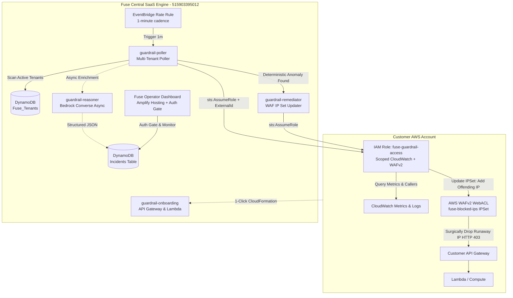

# Fuse: The Cognitive Circuit Breaker for Your AWS Bill

> **An autonomous, context-aware circuit breaker and surgical WAF guardrail for serverless APIs powered by Amazon Bedrock, EventBridge, DynamoDB, AWS WAFv2, and Cross-Account IAM.**  
> Built for **First Commit — Bharat Builds Tour 2026 (Ship It Track)**  
> Builder: **Pranjul Chaurasiya** (@pranjul_chaurasiya | Team Code: `ZK2FP6`)

[Live Console (HTTPS)](https://main.d1hndpgpwb40h8.amplifyapp.com) &bull; [Onboarding Portal](frontend/onboarding.html) &bull; [Demo Video (YouTube)](https://youtu.be/UWzPBdO63ek) &bull; [Architecture Spec](ARCHITECTURE.md) &bull; [3-Minute Demo Video Script](docs/demo-script.md) &bull; [AWS Builder Center Post](docs/blog-post.md)

[-blue?style=for-the-badge&logo=awsamplify)](https://main.d1hndpgpwb40h8.amplifyapp.com)
[](https://youtu.be/UWzPBdO63ek)
[-orange?style=for-the-badge&logo=amazonwebservices)](https://main.d1hndpgpwb40h8.amplifyapp.com)
[](https://aws.amazon.com/bedrock/)
[](https://aws.amazon.com/waf/)
[](https://www.wemakedevs.org/aws/first-commit)

---

## Quick Verification (for Judges)
- **Live Console**: [https://main.d1hndpgpwb40h8.amplifyapp.com](https://main.d1hndpgpwb40h8.amplifyapp.com) *(Protected by Operator Session Gate &mdash; Default: `fuse-operator-2024`)*
- **Customer Onboarding**: [frontend/onboarding.html](frontend/onboarding.html) &mdash; 1-click Cross-Account IAM CloudFormation onboarding without sharing any AWS credentials.
- **Demo Video (2m 58s)**: [https://youtu.be/UWzPBdO63ek](https://youtu.be/UWzPBdO63ek) &mdash; full end-to-end demonstration featuring live anomaly detection, human-in-the-loop approval, and surgical WAF mitigation.
- **Every AWS resource ID in this README is real and independently checkable** &mdash; see Section 05 for exact names/IDs
- **AWS Builder Center Blog Post**: [docs/blog-post.md](docs/blog-post.md) *(published link once live)*

[](https://youtu.be/UWzPBdO63ek)
*Click above to watch the complete 3-minute end-to-end video demonstration on YouTube.*

### How It Works

**Customer Onboarding** (zero credential sharing):
```
Customer Signs Up → Generates ExternalId → 1-Click CloudFormation Stack in Customer AWS → Assumes Cross-Account Role
```

**Runtime** (fully autonomous once running):
```
Observe → Reason & Classify → Isolate (WAF IP Block) → Auto-Recover (Cooldown)
```

* **Onboard**: Customer launches `fuse-cross-account-role.yaml` in their AWS account, granting scoped read (CloudWatch) and write (WAFv2 IP Set) permissions to Fuse's account (`515903395012`).
* **Observe**: EventBridge triggers `guardrail-poller` every 60s, querying tenant CloudWatch metrics and log streams out-of-band.
* **Reason**: Anomaly Z-score & caller dominance tests run deterministically; Bedrock provides asynchronous, structured narrative enrichment.
* **Isolate**: Offending IP addresses are dynamically added to a regional AWS WAFv2 IP Set, surgically dropping runaway loops with HTTP 403 while keeping 100% legitimate traffic flowing.
* **Auto-Recover**: Stale IP blocks automatically expire and unblock after a configurable cooldown window (default: 15 min).

---

## 01 / The Problem

Serverless auto-scaling hides runaway loops. An infinite client retry loop, exponential backoff without jitter, unhandled 500 error cascades, or recursive LLM agent loops can generate thousands of requests per second, accumulating catastrophic AWS bills before human operators wake up.

Traditional CloudWatch static alarms (*"if requests > 100/min then alarm"*) create an impossible operational tradeoff:
* **False Positives**: During a legitimate marketing launch or flash sale with 1,000 unique buyers, a static alarm trips and throttles paying customers.
* **Slow Remediation**: By the time an on-call engineer wakes up, reads an SNS email, and manually updates stage throttling, the damage is already done.

### Strategy vs. Production Outcome

| Defense Strategy | Legitimate Flash Surge (1,000 unique callers) | Recursive Runaway Loop (1 caller, rapid retries) | Production Outcome |
| :--- | :---: | :---: | :--- |
| **No Guardrail** | Normal operation | Thousands of dollars billed in minutes | Unbounded financial liability |
| **Naive Static Alarm** (`Count > 100`) | **Tripped & Throttled (False Outage)** | Throttled (after alert delay) | Kills revenue during marketing launches |
| **Global Stage Throttle** | Preserves system | Kills ALL users (Collateral Damage) | Total outage for paying customers |
| **Fuse (Cognitive WAF Breaker)** | **Passed (Baseline preserved)** | **Offending IP Blocked in WAF** | **Surgical isolation & zero collateral damage** |

**Fuse** solves this by evaluating multi-dimensional context: **caller diversity**, **traffic deltas**, and **deployment heartbeats** with deterministic statistical analysis and Amazon Bedrock, dropping runaway caller IPs at the **AWS WAFv2** edge in seconds without disrupting legitimate traffic.

---

## 02 / System Architecture

### Multi-Tenant SaaS & WAF Edge Topology

```mermaid
flowchart TD
    subgraph CustomerAWS[Customer AWS Account]
        Role[IAM Role: fuse-guardrail-access<br/>Scoped CloudWatch + WAFv2]
        CustCW[CloudWatch Metrics & Logs]
        CustWAF[AWS WAFv2 WebACL<br/>fuse-blocked-ips IPSet]
        CustAPI[Customer API Gateway]
        CustTarget[Lambda / Compute]
    end

    subgraph FuseControl[Fuse Central SaaS Engine - 515903395012]
        EB[EventBridge Rate Rule<br/>1-minute cadence]
        Poller[guardrail-poller<br/>Multi-Tenant Poller]
        Tenants[(DynamoDB<br/>Fuse_Tenants)]
        Incidents[(DynamoDB<br/>Incidents Table)]
        Remediator[guardrail-remediator<br/>WAF IP Set Updater]
        Reasoner[guardrail-reasoner<br/>Bedrock Converse Async]
        OnboardAPI[guardrail-onboarding<br/>API Gateway & Lambda]
        Console[Fuse Operator Dashboard<br/>Amplify Hosting + Auth Gate]
    end

    EB -->|Trigger 1m| Poller
    Poller -->|Scan Active Tenants| Tenants
    Poller -->|sts:AssumeRole + ExternalId| Role
    Role -->|Query Metrics & Callers| CustCW
    Poller -->|Deterministic Anomaly Found| Remediator
    Poller -.->|Async Enrichment| Reasoner
    Reasoner -.->|Structured JSON| Incidents

    Remediator -->|sts:AssumeRole| Role
    Role -->|Update IPSet: Add Offending IP| CustWAF
    CustWAF -->|Surgically Drop Runaway IP HTTP 403| CustAPI
    CustAPI --> CustTarget

    Console -->|Auth Gate & Monitor| Incidents
    CustomerAWS -.->|1-Click CloudFormation| OnboardAPI
```

---

## 03 / Key Architectural Pillars

### 1. Zero Credential Sharing (Cross-Account IAM Roles)
Customers never provide IAM access keys. Onboarding generates a unique `ExternalId` and a 1-click CloudFormation template (`infra/cloudformation/fuse-cross-account-role.yaml`). Fuse accesses tenant telemetry via short-lived, 15-minute `sts:AssumeRole` sessions strictly scoped to read CloudWatch and update WAF IP Sets.

### 2. Surgical WAF Isolation (Zero Collateral Outage)
Unlike crude stage throttles (`RateLimit -> 0`) that shut down entire APIs and punish paying customers during an incident, Fuse acts surgically:
* Identifies offending caller IPs responsible for runaway traffic loops
* Appends offending IPs (`/32`) into AWS WAFv2 IP Sets (`fuse-blocked-ips`)
* Returns immediate **HTTP 403 Forbidden** to the bad actor while preserving **HTTP 200** flow for all normal traffic.

### 3. Automated Cooldown & Self-Healing (Auto-Recovery)
Incidents are not permanent locks. The poller monitors active IP blocks and automatically purges expired IP addresses after a configurable cooldown window (`RECOVERY_WINDOW_MINUTES`, default: 15 min), safely returning the system to normal operations.

### 4. Deterministic Statistical Gating with Bedrock Enrichment
To ensure sub-second response times and eliminate hallucination risk on fast paths:
* **Detection & Remediation**: Run purely deterministically in Python via Z-scores, standard deviations, and caller dominance metrics.
* **Amazon Bedrock (Nova Micro)**: Invoked asynchronously for non-blocking contextual narrative summaries and audit logs without impeding remediation latency.

### 5. Operator Session Lock Screen
The dashboard console features a client-side operator session gate (`auth.js`), preventing unauthorized viewing of incident logs while keeping setup completely serverless.

### 6. Layered Defense-in-Depth (Native WAF + Bedrock Poller)
Fuse uses a two-tier strategy to eliminate detection lag:
* **Tier 1 (Instant Edge Flood Cap)**: Native AWS WAF Rate-Based Rule (`fuse-emergency-burst-cap`) drops violent floods (>500 reqs/5min per IP) at the regional edge within seconds.
* **Tier 2 (Cognitive Poller + Bedrock Sentinel)**: Inspects subtle, low-frequency runaway retry loops (90 reqs/min) that bypass static rate rules over a 15-minute statistical window and orchestrates automated self-healing.

### 7. Threat Model & Operational Boundaries
* **60s CloudWatch Metric Lag**: CloudWatch publishes API Gateway metric data in 1-minute aggregations. The Tier-1 native rate rule provides immediate edge buffering during the aggregation interval.
* **Shared NAT/VPN IP Boundaries**: When multiple clients share an egress proxy IP, surgical IP blocking temporarily affects co-located users. Production v2 roadmaps introduce per-JWT claim / API Key targeted throttling.

---

## 04 / Live Verification & Test Scripts

Every script interacts directly with live AWS endpoints and DynamoDB tables in `ap-south-1`:

| Script | Command | Purpose & Expected Verification |
| :--- | :--- | :--- |
| **Naive Comparison** | `python scripts/simulate_naive_threshold.py` | Proves static threshold fails during flash sale while Fuse preserves legitimate traffic. |
| **Scenario 1 (Legit Traffic)** | `python scripts/load_test_legit.py` | 35 requests from 35 unique callers &rarr; Bedrock classifies `NORMAL`. |
| **Scenario 2 (Runaway Loop)** | `python scripts/load_test_runaway.py` | 40 rapid requests from 1 caller &rarr; Bedrock classifies `RUNAWAY` &rarr; prod withheld in `ApprovalQueue`. |
| **Live Web Approval** | Open [Fuse Console](https://main.d1hndpgpwb40h8.amplifyapp.com) | Click *Approve Circuit Trip* &rarr; Stage `RateLimit` drops to 0 &rarr; Live Probe confirms `HTTP 429`. |
| **Automated End-to-End** | `python scripts/test_day3_remediation.py` | Automated validation of approval, stage mutation, and curl 429 verification. |
| **Clean Slate Reset** | `python scripts/clear_test_data.py` | Wipes DynamoDB incident records and resets API Gateway stage throttles back to 1000/2000. |

---

## 05 / Deployed AWS Resources (ap-south-1)

| Component | AWS Resource Name | Type / Endpoint |
| :--- | :--- | :--- |
| **Fuse Console** | `fuse-console` (`d1hndpgpwb40h8`) | [AWS Amplify Hosting (HTTPS)](https://main.d1hndpgpwb40h8.amplifyapp.com) &bull; Operator Session Gate |
| **Customer Onboarding** | `onboarding.html` | Cross-Account Role generator with 1-click CloudFormation link |
| **Control Plane API** | `guardrail-control-api` (`agcki2mnvi`) | `https://agcki2mnvi.execute-api.ap-south-1.amazonaws.com/prod` |
| **Protected Target API** | `guardrail-demo-api` (`poim5xmgs2`) | `https://poim5xmgs2.execute-api.ap-south-1.amazonaws.com/prod/items` |
| **AWS WAFv2 WebACL** | `fuse-guardrail-acl` | Regional Web ACL managing surgical IP blocking |
| **WAF IP Set** | `fuse-blocked-ips` | Regional IP Set holding blocked `/32` CIDR addresses |
| **DynamoDB State** | `Incidents`, `Fuse_Tenants`, `Deployments` | Amazon DynamoDB (Pay-per-request) |
| **Sentinel Reasoner** | `guardrail-reasoner` | AWS Lambda (Python 3.12, Bedrock Converse async enrichment) |
| **Circuit Remediator** | `guardrail-remediator` | AWS Lambda (Python 3.12, WAFv2 IP Set modifier) |
| **Metrics Poller** | `guardrail-poller` | AWS Lambda (Python 3.12, multi-tenant scanner & dispatcher) |
| **Onboarding API** | `guardrail-onboarding` | AWS Lambda fronted by `/tenants` and `/tenants/{id}/verify` |
| **Incidents Query** | `guardrail-get-incidents` | AWS Lambda fronted by `/incidents` |

---

---

## 06 / Infrastructure as Code (AWS SAM)

The Fuse infrastructure is packaged and provisioned using **AWS Serverless Application Model (SAM)** (`template.yaml` and `samconfig.toml`).

> **Notice — Legacy Terraform Deprecated**: Previous Terraform configurations have been moved to `infra/legacy-terraform/` and are strictly deprecated. All ongoing development, CI/CD, and deployments use AWS SAM. Customer-side onboarding remains in `infra/cloudformation/fuse-customer-onboarding.yaml`.

### SAM Stack Architecture
- **Stack Name**: `fuse-sam` (isolated from any pre-existing hackathon demo resources)
- **DynamoDB Tables**: Auto-named by CloudFormation to prevent name collisions
- **Bedrock Model**: Defaults to cross-region inference profile `apac.amazon.nova-micro-v1:0`
- **Control API**: Secured with `ApiKeyRequired: true`, dedicated API Key, Usage Plan, and scoped CORS

### Quickstart Deployment
```bash
# 1. Build the serverless application
sam build

# 2. Validate template and lint
sam validate --lint

# 3. Deploy to AWS
sam deploy --guided
```
Or use the included `Makefile`:
```bash
make build
make validate
make deploy
```

---

## 07 / Security Notes & Frontend Setup

### Security Notes (Demo-Grade vs. Production)
* **Browser-Side API Key is Demo-Grade Only**: The client-side configuration (`config.js`) exposes the API key to the browser environment. Anyone viewing source code or inspecting DevTools network traffic can view this key. This pattern is strictly for hackathons and scripted prototypes.
* **CORS Does Not Stop Non-Browser Traffic (`curl`)**: Scoped CORS headers (`AllowedOrigin`) prevent unauthorized cross-origin browser requests, but they do NOT restrict command-line tools like `curl`, Postman, or automated scripts if an attacker obtains the API key.
* **Production Authentication Architecture**: Production deployments must eliminate static browser-side API keys in favor of **Amazon Cognito User Pools** (authenticated JWT tokens validated via API Gateway Cognito Authorizers) or **AWS IAM SigV4** authorization mapped to least-privilege IAM roles.

### Frontend Configuration
1. **Retrieve API Key Value**:
   ```bash
   aws apigateway get-api-key --api-key <ControlApiKeyId> --include-value
   ```
2. **Setup Local Config**:
   - Copy `frontend/config.example.js` to `frontend/config.js`:
     ```bash
     cp frontend/config.example.js frontend/config.js
     ```
   - Set `CONTROL_API_BASE`, `API_KEY`, and `TARGET_API_URL`.
   - The browser frontend automatically passes the `x-api-key` header on all fetch requests (`GET /incidents` and `POST /incidents/{incident_id}/approve`).


---

## 08 / Cost Profile & Teardown

### Cost Efficiency
- **DynamoDB**: On-Demand billing (`PAY_PER_REQUEST`) ensures $0 cost when idle.
- **Amazon Bedrock**: Utilizes Amazon Nova Micro (`apac.amazon.nova-micro-v1:0`), costing ~$0.000035 per evaluation (a fraction of a cent).
- **Compute**: EventBridge 1-minute schedule + Poller/Reasoner/Remediator execution falls well within the AWS Lambda Free Tier (1M free requests/month).
- **Estimated Idle/Demo Cost**: Under **$0.50/month**.

### Teardown
To cleanly delete all provisioned AWS resources and state tables:
```bash
sam delete --stack-name fuse-sam
```
Or using the Makefile:
```bash
make delete
```

---

## 09 / Hackathon Evaluation Alignment (First Commit)

| Hackathon Criteria | How Fuse Directly Satisfies It |
| :--- | :--- |
| **01 / Idea & Impact** | Solves the silent financial liability of serverless auto-scaling by replacing dumb thresholds with context-aware anomaly detection. |
| **02 / Built on AWS** | Deployed live across 6 native AWS services in `ap-south-1`: Lambda, API Gateway, DynamoDB, Bedrock, CloudWatch, EventBridge, and S3/Amplify. |
| **03 / Learning** | Mastered Amazon Bedrock Converse API structured tool calling, CloudWatch metric correlation, and isolated control plane architecture. |
| **04 / Execution** | Complete end-to-end working system: live poller, Bedrock classification, approval queue, stage throttle remediation, and responsive dashboard. |
| **05 / Demo Video** | [Watch on YouTube (2m 58s)](https://youtu.be/UWzPBdO63ek) — 3-minute scripted demonstration showing live anomaly detection, human approval, and real HTTP 429 stage cutoff. |

---

## 10 / Key Learnings

1. **Structured Tool Calls over Free-Text**: Using Bedrock Converse with `toolConfig` turned an LLM into a reliable, typed microservice with zero JSON parsing failures.
2. **Context Eliminates False Outages**: Correlating deployment heartbeats and unique caller ratios completely solves the false-positive outage problem inherent to static CloudWatch alarms.
3. **Control Plane Isolation is Essential**: Decoupling the management API from the workload API guarantees that an emergency circuit trip never locks the operator out of the control room.

---

## 11 / Project Documentation

* [YouTube Demo Video](https://youtu.be/UWzPBdO63ek) — 3-Minute Live Anomaly Mitigation Walkthrough
* [docs/demo-script.md](docs/demo-script.md) — 3-Minute Video Walkthrough Script
* [docs/blog-post.md](docs/blog-post.md) — AWS Builder Center Technical Article
* [PRD.md](PRD.md) — Product Requirements Document
* [ARCHITECTURE.md](ARCHITECTURE.md) — Architecture & Data Flow Specifications
* [SCHEMA.md](SCHEMA.md) — DynamoDB Table Schemas
* [API.md](API.md) — Internal Interface Contracts
* [TASKS.md](TASKS.md) — Hackathon Build Log & Progress

